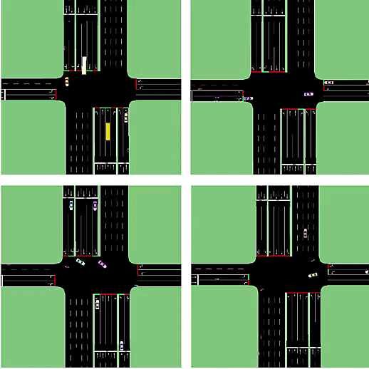
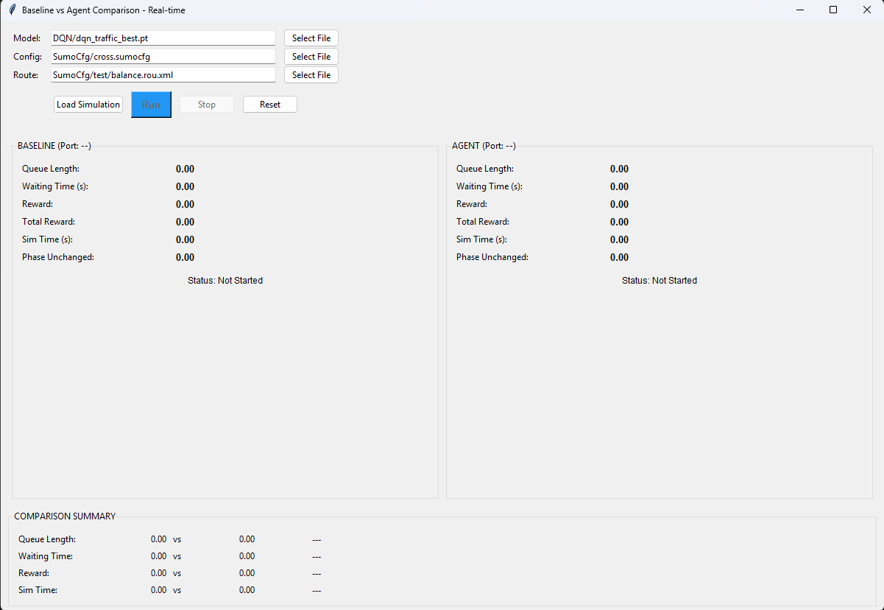
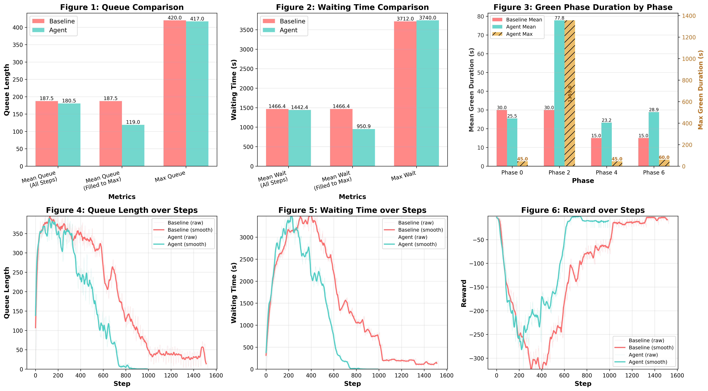

# Traffic Light Control using DQN

A simulation-based **traffic light control** system for a real Ho Chi Minh intersection, built with Python, PyTorch, and SUMO. A **Deep Q-Network (DQN)** agent learns to minimize vehicle queue lengths and waiting times by dynamically controlling traffic light phases.

<p align="center">

</p>
> *The animation above shows 4 single-direction traffic scenarios (NS-only, EW-only, NS-turn_left-only, EW-turn_left-only): the DQN agent correctly keeps the green phase on the active direction throughout each scenario, while the fixed-cycle baseline wastes time cycling through empty phases.*

---

## Research Paper

This project is accompanied by a research report describing the problem formulation, environment design, reward shaping, and experimental results. If you want to learn more about the technical approach — including the state representation, action space, reward function, and multi-route training strategy — please refer to the report.

The report covers: [**Proposal of an intelligent traffic light control system based on real-time vehicle density detection**](https://drive.google.com/file/d/15fspocR7gb2rX6SwEOKGjYtgHLz9GRnJ/view?usp=sharing)

- Road network modelling of a real Ho Chi Minh City intersection using SUMO
- Gymnasium-based RL environment with 57-dimensional state space
- DQN with experience replay and target network
- Reward function design (linear penalty + progressive penalty for long phases)
- Multi-route training to improve generalization
- Quantitative comparison between fixed-cycle baseline and DQN agent

---

## Features

- **DQN-based adaptive control** — the agent selects one of 4 green phases at each decision step to minimize queue lengths and waiting times
- **57-dimensional state space** — queue lengths, vehicle counts, max accumulated waiting time per lane group, one-hot current phase, and normalized phase duration
- **Reward shaping** — linear penalty for queues and waiting times, progressive penalty for excessively long phases, and penalties for useless green phases
- **Multi-route training** — train across diverse traffic demand scenarios (random, cycle, or block selection modes) to avoid overfitting to a single route
- **Catastrophic forgetting prevention** — optional replay buffer persistence across training sessions
- **Real-time comparison demo** — a Tkinter GUI runs the fixed-cycle baseline and the DQN agent simultaneously in two SUMO windows with live metrics
- **Checkpoint system** — models are saved every 50 episodes and the best-performing model is tracked separately

---

## Project Structure

```
XaloHaNoi_DoXuanHop_final/
├── rl_environment.py           # Gymnasium environment wrapping SUMO via TraCI
├── train_dqn_multi_route.py    # DQN training script with multi-route support
├── demo.py                     # Real-time Tkinter GUI for Baseline vs Agent comparison
├── SumoCfg/
│   ├── cross.sumocfg           # Main SUMO configuration file
│   ├── net.net.xml             # Road network (real Ho Chi Minh City intersection)
│   ├── vtypes.add.xml          # Vehicle type definitions
│   ├── rwcustom.xml            # Custom GUI settings
│   ├── train/                  # Route files used during training (.rou.xml)
│   └── test/                   # Route files used during testing/demo (.rou.xml)
├── DQN/
│   └── dqn_traffic_best.pt     # Pre-trained best DQN model weights
├── requirements.txt
├── demo.gif                    # Single-direction bias test animation
├── pipeline.gif                # Full demo pipeline animation (controller + SUMO windows)
├── result.png                  # 6-panel quantitative comparison chart
└── README.md
```

---

## Requirements

- **Python 3.10+** (Python 3.11 recommended)
- **SUMO 1.19+** — must be installed separately and added to PATH
- **GPU is optional** — CPU inference is fast enough for single-simulation use; GPU speeds up batch training

---

## Installation

### 1. Install SUMO

Download and install SUMO from the official site: https://sumo.dlr.de/docs/Installing/index.html

Make sure the `sumo` and `sumo-gui` binaries are accessible from your PATH (or set the `SUMO_HOME` environment variable).

### 2. Clone the repository

```bash
git clone https://github.com/DuyLeTran/TrafficLightControl
cd TrafficLightControl
```

### 3. Create and activate a virtual environment (recommended)

```bash
# Windows
python -m venv venv
venv\Scripts\activate

# macOS / Linux
python -m venv venv
source venv/bin/activate
```

### 4. Install dependencies

```bash
pip install -r requirements.txt
```

> **CPU vs GPU:**
> The default `requirements.txt` installs the CPU build of PyTorch, which is the **recommended setup** for running the demo.
>
> If you want GPU acceleration during training, install the CUDA build manually:
>
> ```bash
> # Example for CUDA 12.8
> pip install torch --index-url https://download.pytorch.org/whl/cu128
> ```

---

## Usage

### Running the Real-Time Demo

The demo GUI compares the fixed-cycle **Baseline** against the trained **DQN Agent** side-by-side in two SUMO windows.

```bash
python demo.py
```
<p align="center">

</p>

1. In the GUI, verify the paths for **Model**, **Config**, and **Route** files.
2. Click **Load Simulation** — two SUMO windows open and initialize.
3. Click **Run** — both simulations start simultaneously.
4. Watch the real-time metrics (queue length, waiting time, reward) update live.
5. When finished, a comparison summary and plots are displayed automatically.

**Live metrics** displayed for both Baseline and Agent during the simulation:

| Metric              | Description                                                                 |
| ------------------- | --------------------------------------------------------------------------- |
| **Queue Length**    | Total number of halting vehicles across all lanes at the current step       |
| **Waiting Time (s)**| Cumulative waiting time of all vehicles in the network at the current step  |
| **Reward**          | Immediate reward received at the current decision step                      |
| **Total Reward**    | Sum of all rewards accumulated since the simulation started                 |
| **Sim Time (s)**    | Elapsed simulation time in seconds                                          |
| **Phase Unchanged** | Whether the current green phase is ineffective — `True` if no vehicles are present on any lane of the active green phase (useless green), `False` otherwise |

### Demo Results — Balanced Traffic Scenario

The table below shows the demo pipeline alongside the quantitative results on a balanced traffic demand scenario (`balance.rou.xml`), where vehicles are generated from all directions simultaneously.


<p align="center">

<br><sub><i>Demo pipeline: controller GUI (left) manages both simulations; DQN Agent (top-right) and Baseline (bottom-right) run simultaneously in separate SUMO windows</i></sub>
</p>

<p align="center">

<br><sub><i>Six-panel comparison on balanced traffic: (1) queue length metrics, (2) waiting time metrics, (3) green phase duration with dual y-axis (mean left / max right), (4–5) queue & waiting time time-series, (6) step reward — the DQN agent consistently outperforms the fixed-cycle baseline across all metrics</i></sub>
</p>


> *The DQN agent consistently reduces queue lengths and waiting times by dynamically prioritizing the most congested phase, while the fixed-cycle baseline wastes green time on empty phases. Figure 3 uses a dual y-axis (mean on the left, max on the right) to highlight phase bias without compressing the mean bars.*

---

## Training

Training from scratch on a single route file:

```bash
python train_dqn_multi_route.py \
  --route-file SumoCfg/train/balance.rou.xml \
  --num-episodes 500 \
  --save-folder DQN \
  --model-name dqn_traffic.pt
```

Training on all route files in a directory (random selection mode):

```bash
python train_dqn_multi_route.py \
  --route-dir SumoCfg/train \
  --route-selection-mode random \
  --num-episodes 500 \
  --save-folder DQN \
  --model-name dqn_traffic.pt
```

Resuming training from a checkpoint:

```bash
python train_dqn_multi_route.py \
  --route-dir SumoCfg/train \
  --load-pretrain \
  --pretrain-path DQN/dqn_traffic_best.pt \
  --start-episode 500 \
  --num-episodes 500 \
  --save-folder DQN \
  --model-name dqn_traffic_v2.pt
```

Training with replay buffer persistence (prevents catastrophic forgetting):

```bash
python train_dqn_multi_route.py \
  --route-dir SumoCfg/train \
  --load-pretrain \
  --pretrain-path DQN/dqn_traffic.pt \
  --previous-buffer DQN/replay_buffer.pkl \
  --save-buffer DQN/replay_buffer_new.pkl \
  --num-episodes 300
```

Enable SUMO GUI during training (slower, useful for debugging):

```bash
python train_dqn_multi_route.py \
  --route-file SumoCfg/train/balance.rou.xml \
  --gui \
  --delay 100
```

---

## Configuration

### Training Hyperparameters

| Argument                    | Default    | Description                                                              |
| --------------------------- | ---------- | ------------------------------------------------------------------------ |
| `--num-episodes`            | `500`      | Number of training episodes                                              |
| `--buffer-capacity`         | `500000`   | Replay buffer capacity                                                   |
| `--batch-size`              | `64`       | Batch size for network updates                                           |
| `--gamma`                   | `0.995`    | Discount factor                                                          |
| `--lr`                      | `1e-3`     | Adam optimizer learning rate                                             |
| `--eps-start`               | `1.0`      | Initial epsilon for ε-greedy exploration                                 |
| `--eps-end`                 | `0.05`     | Final epsilon                                                            |
| `--eps-decay-episodes`      | `300`      | Number of episodes for linear epsilon decay                              |
| `--target-update-interval`  | `10`       | Episodes between target network updates                                  |

### Environment & Route Options

| Argument                    | Default    | Description                                                              |
| --------------------------- | ---------- | ------------------------------------------------------------------------ |
| `--route-dir`               | `None`     | Directory containing `.rou.xml` route files (all files used)             |
| `--route-file`              | `None`     | Single route file path (overrides `--route-dir`)                         |
| `--route-selection-mode`    | `random`   | `random`, `cycle`, or `block` — how to pick routes across episodes       |
| `--episodes-per-route`      | `3`        | Episodes per route when using `block` mode                               |
| `--config-file`             | `SumoCfg/cross.sumocfg` | SUMO configuration file                                   |
| `--step-length`             | `0.1`      | SUMO simulation step length (seconds)                                    |
| `--gui`                     | `False`    | Show SUMO GUI during training                                            |
| `--delay`                   | `0`        | SUMO GUI animation delay (ms)                                            |

### Catastrophic Forgetting Prevention

| Argument                    | Default | Description                                                                   |
| --------------------------- | ------- | ----------------------------------------------------------------------------- |
| `--previous-buffer`         | `None`  | Path to replay buffer from a previous training run                            |
| `--save-buffer`             | `None`  | Path to save the replay buffer after training (for use in the next session)   |
| `--buffer-retention-ratio`  | `0.3`   | Fraction of old buffer samples to retain (0.0–1.0)                            |

---

## Environment Details

### State Space (57 features)

| Component                        | Dimension | Description                                              |
| -------------------------------- | --------- | -------------------------------------------------------- |
| Queue lengths (per lane group)   | 16        | Normalized halting vehicle count, divided by 80          |
| Vehicle counts (per lane group)  | 16        | Normalized total vehicle count, divided by 80            |
| Max accumulated waiting time     | 16        | Max per-vehicle accumulated waiting time, divided by 120 |
| Current phase (one-hot)          | 8         | One-hot encoding of the current SUMO traffic light phase |
| Phase duration `rt`              | 1         | Time (s) the current green phase has been active / 120   |

Lane groups: **S1–S6** (south), **N1–N6** (north), **W1–W2** (west), **E1–E2** (east)

### Action Space

4 discrete actions corresponding to 4 green phases:

| Action | Phase | Directions                         |
| ------ | ----- | ---------------------------------- |
| 0      | 0     | S↔N straight                       |
| 1      | 2     | S/N right-turn + W↔E straight      |
| 2      | 4     | S/N left-turn                      |
| 3      | 6     | W↔E left-turn                      |

Each action triggers a 5-second yellow transition (if switching) followed by a 5-second green extension.

### Reward Function

```
R = R_linear + R_progressive + penalties

R_linear      = -0.25 × Σ(normalized queue) - 0.5 × Σ(normalized waiting time)
R_progressive = -0.15 × Σ(max(0, waiting_time - 120))   # extra penalty for long waits

Penalties:
  -5   if phase was switched (transition cost)
  -10  if green phase has run > 120 seconds (too long)
  -15  if green phase is ineffective (no cars moving or improving)
```

---

## Network Architecture

The DQN policy network is a 3-layer fully connected network:

```
Input (57) → Linear(128) → ReLU → Linear(128) → ReLU → Linear(4)
```

A separate **target network** (same architecture) is updated every `--target-update-interval` episodes to stabilize training.

---

## License

This project is for educational and research purposes. Please contact the author before using it in commercial products. leduytran0501@gmail.com

---

*Developed as part of a research project on Reinforcement Learning for Adaptive Traffic Signal Control.*
